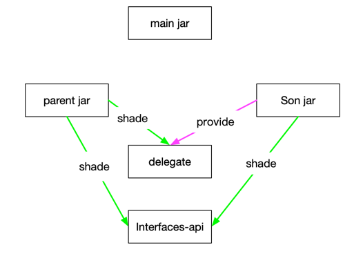
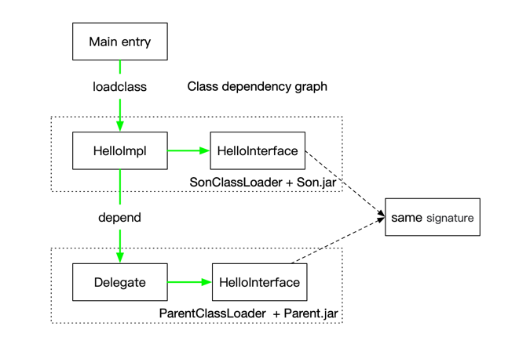
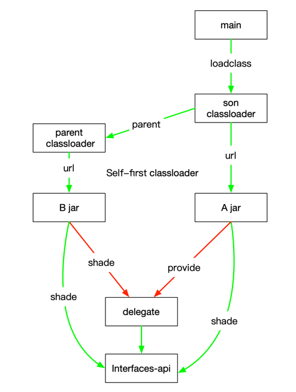

## JAVA LinkageError 复现项目

目的: 使用 maven 多模块项目, 复现 `java.lang.LinkageError: loader constraint violation: loader (instance of org/example/ParentClassLoader) previously initiated loading for a different type with name "org/example/HelloInterface"`

## 环境
1. jdk1.8
2. maven 3.5

## 测试
1. 打包根目录, 会自动生成 parent-plugins + son-plugins
2. 运行 `org.example.Main`
3. 出现以下日志

```log
son org.example.HelloImplSon start, 
son org.example.HelloInterface start, 
son java.lang.Object start, 
java.lang.Object
parent java.lang.Object start, 
java.lang.Object
son org.example.HelloInterface end, org.example.SonClassLoader@311d617d
son org.example.HelloImplSon end, org.example.SonClassLoader@311d617d
son java.lang.Throwable start, 
java.lang.Throwable
parent java.lang.Throwable start, 
java.lang.Throwable
son java.lang.Error start, 
java.lang.Error
parent java.lang.Error start, 
java.lang.Error
son org.example.HelloModel start, 
son org.example.HelloModel end, org.example.SonClassLoader@311d617d
son org.example.Delegate start, 
org.example.Delegate
parent org.example.Delegate start, 
parent java.lang.Object start, 
java.lang.Object
parent org.example.Delegate end, org.example.ParentClassLoader@6ed3ef1
parent org.example.HelloInterface start, 
java.lang.LinkageError: loader constraint violation: loader (instance of org/example/ParentClassLoader) previously initiated loading for a different type with name "org/example/HelloInterface"
	at java.lang.ClassLoader.defineClass1(Native Method)
	at java.lang.ClassLoader.defineClass(ClassLoader.java:760)
	at java.security.SecureClassLoader.defineClass(SecureClassLoader.java:142)
	at java.net.URLClassLoader.defineClass(URLClassLoader.java:467)
	at java.net.URLClassLoader.access$100(URLClassLoader.java:73)
	at java.net.URLClassLoader$1.run(URLClassLoader.java:368)
	at java.net.URLClassLoader$1.run(URLClassLoader.java:362)
	at java.security.AccessController.doPrivileged(Native Method)
	at java.net.URLClassLoader.findClass(URLClassLoader.java:361)
	at org.example.MyClassLoader.loadClass(MyClassLoader.java:76)
	at org.example.HelloImplSon.hello(HelloImplSon.java:28)
	at sun.reflect.NativeMethodAccessorImpl.invoke0(Native Method)
	at sun.reflect.NativeMethodAccessorImpl.invoke(NativeMethodAccessorImpl.java:62)
	at sun.reflect.DelegatingMethodAccessorImpl.invoke(DelegatingMethodAccessorImpl.java:43)
	at java.lang.reflect.Method.invoke(Method.java:498)
	at org.example.Main.main(Main.java:18)
```

## 依赖描述

maven 依赖


类依赖


jar 依赖


